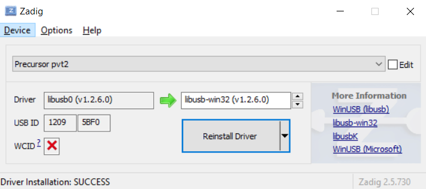

# Tools

## usb_update.py

### Installation: Linux

* `pip3 install pyusb`
* you probably need to run as `sudo`: `sudo ./usb_update.py` to access the USB port
* if you don't like using `sudo`, I hear somethig involving udev can solve this problem, but I've never been able to get it to work. If someone can contribute a simple, solid cross-distro guide to USB `udev` rules I'm guessing the Internet would appreciate it.

### Installation: Windows 10

* You will need to install python3 from the Windows App store
* Run `pip3 install pyusb` from a Powershell
* use [zadig](https://zadig.akeo.ie/) to remap `Precursor pvt2`'s Windows driver to `libusb-win32`
* Run `python3 .\usb_update.py` (with your desired arguments) from a Powershell

### Installation: MacOS

We have no experience with MacOS, nor do we own any Apple machines. In short, we have no idea, and
no way to figure it out or test it. If someone can contribute a guide that'd be great.
